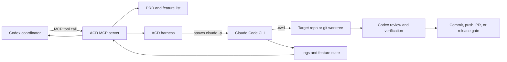

# Controlling Claude Code from Codex with ACD

This runbook records how Codex coordinated real Claude Code instances during the
multi-app improvement wave on 2026-08-10. It covers the working control loop,
authentication, worktree isolation, monitoring, review, and recovery.

The central rule is simple:

> Claude Code performs a bounded implementation task. Codex owns orchestration,
> independent verification, integration, and release decisions.

This is process-level control through ACD. It is not screen sharing or remote
typing into an interactive Claude Code terminal.

## Architecture



The relevant implementation files are:

- `engine/acd-mcp-server.js`: exposes the `acd_*` control tools.
- `engine/run-harness-v2.js`: launches the real `claude` executable.
- `engine/run-queue.js`: enforces the global concurrency cap.
- `engine/watchdog.js`: restarts stalled queue processes.
- `engine/launch.sh`: supervised shell entry point.
- `data/prds/<slug>.md`: durable task direction.
- `data/features/<slug>.json`: testable completion contract.
- `data/logs/<slug>.log`: process output.
- `data/pids/<slug>.pid`: harness process identity.

## What ACD Actually Launches

The harness invokes Claude Code non-interactively in the target directory:

```text
claude -p <prompt> \
  --model <model> \
  --dangerously-skip-permissions \
  --output-format stream-json \
  --verbose \
  --mcp-config <acd/.mcp.json> \
  --agents <acd/.claude/agents> \
  --append-system-prompt <capability-guidance>
```

`targetPath` becomes the child process working directory. Passing a worktree
path directs the intended code changes and commit history to that worktree; it
does not create an operating-system sandbox.

The current harness checks for output every minute, terminates a session after
15 minutes of silence by default, and applies a two-hour wall-clock limit by
default. It sends `SIGTERM` first and `SIGKILL` five seconds later if needed.

## Authentication

Use Claude subscription OAuth for coding agents. Do not paste OAuth tokens into
Codex, a PRD, a commit, a log, or shell history.

### Preferred: stored Claude Code login

Authenticate once in a normal terminal:

```bash
claude auth login
claude auth status
```

ACD supports this stored login. If `CLAUDE_CODE_OAUTH_TOKEN` is absent, the
harness allows Claude Code to read its existing local authentication.

### Unattended token mode

If a background service cannot access stored login state, generate a supported
long-lived token in a private terminal:

```bash
claude setup-token
```

Place the result in a private environment source such as `acd/.env`, keep that
file gitignored, and restrict its permissions:

```bash
chmod 600 /Users/isaiahdupree/Documents/Software/acd/.env
```

Export or source the environment before starting the ACD MCP server or queue.
Never scrape the token from Chrome, browser storage, the macOS Keychain, Claude
Code files, or another running process.

### API key boundary

The coding harness intentionally removes `ANTHROPIC_API_KEY` from the Claude
child environment and refuses to start if the harness itself inherits that
variable. Start OAuth-only execution with the variable unset:

```bash
env -u ANTHROPIC_API_KEY npm run mcp
```

There is one current ACD limitation: `acd_dispatch` calls
`acd_generate_features`, and that feature-extraction function still requires
`ANTHROPIC_API_KEY`. At the same time, the coding harness rejects that variable.
Until feature extraction is migrated to the Claude CLI or its environment is
fully separated, use the explicit OAuth-only flow below for dependable runs.

## Reliable OAuth-Only Control Loop

### 1. Inspect the target first

Codex reads the target repository instructions, existing changes, test scripts,
and branch state before delegation:

```bash
cd /absolute/path/to/repo
git status --short --branch
find .. -name AGENTS.md -o -name CLAUDE.md
```

Do not delegate over unexplained local changes. Preserve user work and choose a
separate worktree when parallel edits are likely.

### 2. Create a dedicated branch and worktree

Use one branch per app and one worktree per independently running agent:

```bash
git -C /absolute/path/to/repo worktree add \
  /absolute/path/to/repo/.claude/worktrees/<task-name> \
  -b <branch-name>
```

Example convention from the app wave:

```text
branch:   release/icon-refresh-roomredo-20260810
worktree: .claude/worktrees/release-icon-refresh-roomredo-20260810
```

Never point two coding agents at the same writable checkout.

### 3. Save the direction as a PRD

Codex writes a durable task direction to:

```text
/Users/isaiahdupree/Documents/Software/acd/data/prds/<slug>.md
```

A useful PRD states:

- The exact target and user outcome.
- Files or product surfaces in scope.
- Acceptance criteria that can be verified.
- Required build, test, and visual checks.
- Git constraints: no reset, clean, stash, or unrelated reversions.
- Authority limits: no push, production deploy, or App Store submission unless
  explicitly granted.
- Secret handling and prohibited credential access.

Example direction:

```markdown
# RoomRedo intro before language selection

Add a polished, branded intro screen before the language selector. Preserve the
existing language flow and user data. Verify safe areas on current compact and
large iPhone simulators, run the real test/build commands, and capture final
screenshots.

Do not push, submit to App Store Connect, modify secrets, reset the worktree,
stash changes, or revert unrelated work. Commit only the scoped implementation
after verification and report the exact commands and outputs used.
```

### 4. Create a feature contract

For the OAuth-only path, Codex creates the feature file directly instead of
calling the API-key-backed extractor:

```json
{
  "project": "roomredo-intro-language",
  "version": "1.0.0",
  "description": "Branded intro before language selection",
  "features": [
    {
      "id": "ROOMREDO-INTRO-LANGUAGE-001",
      "name": "Show a branded intro before language selection on first launch",
      "category": "ui",
      "priority": 1,
      "passes": false,
      "status": "pending"
    },
    {
      "id": "ROOMREDO-INTRO-LANGUAGE-002",
      "name": "Verify intro and language flow on compact and large iPhones",
      "category": "testing",
      "priority": 1,
      "passes": false,
      "status": "pending"
    }
  ]
}
```

Save it at:

```text
/Users/isaiahdupree/Documents/Software/acd/data/features/<slug>.json
```

The feature list is an acceptance contract, not a progress estimate. A feature
may be marked passing only after its behavior is verified.

### 5. Start Claude Code from Codex

Codex calls the ACD MCP tool with absolute paths:

```text
acd_start({
  slug: "roomredo-intro-language",
  promptPath: "/Users/isaiahdupree/Documents/Software/acd/data/prds/roomredo-intro-language.md",
  featureListPath: "/Users/isaiahdupree/Documents/Software/acd/data/features/roomredo-intro-language.json",
  targetPath: "/Users/isaiahdupree/Documents/Software/roomredo/.claude/worktrees/release-icon-refresh-roomredo-20260810",
  model: "claude-sonnet-4-6"
})
```

`acd_start` launches the detached harness and returns its PID and log path.

The supervised shell alternative is:

```bash
/Users/isaiahdupree/Documents/Software/acd/engine/launch.sh \
  roomredo-intro-language \
  /Users/isaiahdupree/Documents/Software/roomredo/.claude/worktrees/release-icon-refresh-roomredo-20260810
```

### 6. Monitor the run

Use ACD state first:

```text
acd_list_running({})
acd_status({
  slug: "roomredo-intro-language",
  featureListPath: "/Users/isaiahdupree/Documents/Software/acd/data/features/roomredo-intro-language.json"
})
acd_logs({ slug: "roomredo-intro-language", lines: 100 })
acd_get_log_errors({ slug: "roomredo-intro-language", lines: 50 })
```

Then corroborate it with operating-system and git state:

```bash
git -C /absolute/path/to/worktree status --short --branch
git -C /absolute/path/to/worktree log -5 --oneline
ps -p <harness-pid> -o pid=,etime=,command=
```

Do not interpret every long-lived process named `claude` as one of the active
tasks. Claude background services may outlive a harness. Match the ACD PID,
slug, target path, logs, and git changes before taking action.

### 7. Review independently

An agent report is evidence, not acceptance. After Claude Code finishes, Codex:

1. Re-reads repository instructions and checks for late writes.
2. Reviews `git status`, the complete diff, and recent commits.
3. Confirms changes stayed inside the requested scope.
4. Reruns the critical unit, integration, build, export, and UI checks.
5. Inspects screenshots at representative device sizes for UI work.
6. Checks versioning, signing, privacy, localization, and store metadata when
   release files changed.
7. Removes redundant generated artifacts only when ownership is certain.
8. Commits and pushes only after the acceptance gate passes.

Useful commands:

```bash
git -C /absolute/path/to/worktree diff --check
git -C /absolute/path/to/worktree diff --stat
git -C /absolute/path/to/worktree diff
git -C /absolute/path/to/worktree status --short --branch
```

For projects with a real test script, Codex can also call:

```text
acd_run_tests({
  slug: "roomredo-intro-language",
  targetPath: "/absolute/path/to/worktree",
  timeout: 600000
})
```

### 8. Integrate and release deliberately

Keep these as separate gates:

```text
implementation -> review -> tests -> commit -> push -> PR -> merge -> store upload -> store submission
```

Granting implementation authority does not grant production or App Store
authority. App Store Connect inspection can be read-only while an app is in
review; do not cancel reviews or replace builds unless explicitly directed.

## Running a Bounded Fleet Wave

For multiple apps, Codex prepares all branches and worktrees, then starts only as
many tasks as the configured concurrency cap permits. The current default is:

```text
ACD_MAX_CONCURRENCY=4
```

A wave should have a small manifest outside the app repositories:

| Field | Purpose |
|---|---|
| `slug` | Stable ACD task identifier |
| `repo` | Canonical source repository |
| `worktree` | Exclusive writable checkout |
| `branch` | Reviewable integration branch |
| `prd` | Saved direction and limits |
| `featureList` | Machine-readable acceptance contract |
| `agent/session` | ACD or Claude process identity |
| `status` | Queued, running, review, accepted, or blocked |

The recent app wave used six repositories for eight App Store listings:

| Product | Repository/worktree branch pattern | Claude session ID |
|---|---|---|
| Podcast Studio for Mac / AI Podcast Studio | `release/icon-refresh-podcaststudio-20260810` | `021f890b` |
| Pace: Run Club | `release/icon-refresh-pace-20260810` | `8b060026` |
| RoomRedo for Mac / RoomRedo: AI Room Design | `release/icon-refresh-roomredo-20260810` | `2f694e7a` |
| MindLink: Dyad Lab | `release/icon-refresh-mindlink-20260810` | `7c3817f0` |
| MediaSuite | `release/icon-refresh-mediasuite-20260810` | `bf2ef34c` |
| Vault: Crypto Wallet | `release/icon-refresh-vault-20260810` | `6995bff4` |

Those IDs were manager-reported session identifiers used for correlation. They
are not a public `acd_*` command and should not be treated as resumable IDs
unless the active manager exposes a matching resume operation.

## Lessons from the App Wave

### ACD state can become stale

An old PID file or historical session record can say a task is running after the
child has exited. Correlate four sources before deciding:

1. `acd_status` and `acd_list_running`.
2. The exact PID from `data/pids/<slug>.pid`.
3. Recent timestamps in `data/logs/<slug>.log`.
4. Source, test artifacts, and git commits in the target worktree.

Use `acd_prune_pids({})` for confirmed stale PID files. Do not kill unrelated
Claude processes by broad name matching.

### Agents can finish or commit late

Re-run `git status` and inspect the last commits immediately before Codex edits,
tests, commits, or pushes. A status snapshot from several minutes earlier is not
an integration lock.

### Simulators are shared infrastructure

Parallel iOS agents can boot, erase, or delete the same simulator and can leave
screenshots from another app in a worktree. Use dedicated simulator IDs where
possible, clean-install the intended build, and verify app identity in every
screenshot.

### A locked Mac changes the test plan

GUI automation may fail while command-line builds, headless simulator boot,
installation, launch, and screenshot capture still work. Record which layer was
actually verified instead of reporting generic "UI tests passed."

### UI runners and bundlers can hang

Maestro and Metro produced stale or hanging processes during the wave. Before a
retry, identify the owning PID and target path, terminate only the stale process,
restart the service cleanly, and confirm the new process serves the intended
worktree.

### Visual acceptance requires human-level inspection

The RoomRedo implementation built successfully but screenshots exposed safe-area
defects. Codex corrected them after the agent run. Build success is necessary;
it is not proof of a polished UI.

### Preserve accepted brand assets exactly

For MindLink, the accepted previous icon was preserved by file hash rather than
re-created by appearance. When a specific asset is approved, record its source
and checksum before delegating adjacent visual changes.

## Stop and Recovery

Request a graceful stop first:

```text
acd_stop({ slug: "roomredo-intro-language", force: false })
```

Use a forced stop only after graceful termination fails and the PID has been
matched to the target task:

```text
acd_stop({ slug: "roomredo-intro-language", force: true })
```

After a failure:

1. Read the final log and error lines.
2. Check whether the process still exists.
3. Inspect the worktree for partial edits and late commits.
4. Run `git diff --check` and the smallest relevant test.
5. Update the PRD or feature contract with the discovered constraint.
6. Restart the same slug only when its state is understood.

Do not recover with `git reset --hard`, `git clean`, or a blanket process kill.

## Security and Authority Boundaries

The current harness passes `--dangerously-skip-permissions` to Claude Code. That
means the target must be trusted, and prompt restrictions are not a substitute
for operating-system sandboxing. Reduce exposure before launch:

- Use a dedicated git worktree.
- Keep secrets out of repositories and PRDs.
- Export only credentials required by the task.
- Do not expose signing, deployment, or App Store credentials to implementation
  agents unless the task explicitly requires and authorizes them.
- State prohibited destructive git commands in the PRD.
- Keep push, merge, deploy, and submission authority with Codex by default.
- Review every diff and rerun meaningful verification before integration.

## Completion Checklist

- [ ] Claude Code authentication verified with `claude auth status`.
- [ ] `ANTHROPIC_API_KEY` absent from the coding harness environment.
- [ ] Repository instructions and existing changes inspected.
- [ ] Dedicated branch and worktree created.
- [ ] PRD saved with scope, acceptance criteria, tests, and authority limits.
- [ ] Feature JSON saved with independently testable outcomes.
- [ ] ACD started with absolute paths and the intended model.
- [ ] PID, logs, feature state, and worktree changes correlated.
- [ ] Full diff reviewed after the agent stopped writing.
- [ ] Critical tests, builds, exports, and screenshots rerun by Codex.
- [ ] Release-sensitive changes checked separately.
- [ ] Commit and push performed only after acceptance.
- [ ] Worktree retained until PR or integration is complete.
